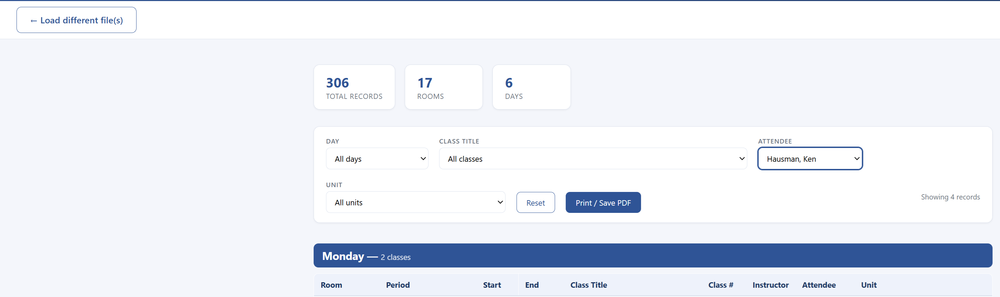

# Class Schedule Report Generator

Turn your **BlackPug class‑data export** into a clean, sorted, filterable, **print‑ready schedule** — grouped by day, with automatic fixes for the provider's data quirks (full‑day classes mislabeled as morning, and multi‑day courses that only show one day).

There are **two ways** to use it — pick whichever you prefer:

| | **Option A — Web App** (easiest) | **Option B — PowerShell Script** (advanced) |
|---|---|---|
| Install needed | **None** | Windows + Microsoft Excel |
| How | Double‑click an HTML file, pick your spreadsheet | Run a script from PowerShell |
| Reads `.xls` directly | ✅ Yes (no conversion) | ⚠️ Convert to `.xlsx` first |
| Works on Mac/Chromebook | ✅ Yes | ❌ Windows only |
| Best for | Most people | Automation / power users |

📖 **Detailed step‑by‑step guides (with screenshots):**
- **[Web App Guide](docs/WEB-APP-GUIDE.md)** — the no‑install browser tool (recommended)
- **[PowerShell Guide](docs/POWERSHELL-GUIDE.md)** — the command‑line script

---

## Option A — Web App (recommended, no install)

The simplest way — works on any computer with a web browser. Nothing is installed, and **your data never leaves your device** (everything runs locally in the browser).

1. **Download** [`ClassScheduleReport.html`](ClassScheduleReport.html) from this repo. *(Click the file above → the **Download raw file** button, or use the green **Code → Download ZIP** button.)*
2. Get your class data export (`.xls` **or** `.xlsx`) from **[BlackPug](https://scoutingevent.com/)**.
3. **Double‑click `ClassScheduleReport.html`** to open it in your browser.
4. Click **"Browse for file…"** (or drag the file in) and select your export.
5. Done! The report appears instantly. Use the **filters** (Day / Class / Attendee / Unit) and the **Print / Save PDF** button.

> 💡 Reads legacy `.xls` **and** `.xlsx` directly — no "save as" conversion step needed. To merge several troops, just select multiple files at once and filter by **Unit**.

---

## Option B — PowerShell Script (advanced)

> This was the original approach. It produces the same report but runs from the command line on Windows (with Excel installed). Handy for automation or if you prefer scripting.

> **Note:** You'll only have to do the setup/configuration **once**. After that, you can just run the command in [Step 9](#step-9--generate-the-report) from a PowerShell prompt any time you need to refresh the report. But hopefully your schedules are locked in by now! 😊

### What you'll need

- A **Windows** PC with **Microsoft Excel** installed (Excel is used to read the spreadsheet).
- The **`Generate-ClassReport.txt`** file (in this repo).
- Your class data export from **BlackPug** → <https://scoutingevent.com/>

---

### One‑time setup

### Step 1 — Save the script
Save the **`Generate-ClassReport.txt`** file to your **Downloads** folder.

### Step 2 — Rename the extension
Click the file and change the extension from **`.TXT`** to **`.PS1`**, so it becomes:

```
Generate-ClassReport.ps1
```

> If you don't see file extensions, open **File Explorer → View → Show → File name extensions** and turn it on.

### Step 3 — Get your data from BlackPug
Log in to **<https://scoutingevent.com/>** and download your class data **`.XLS`** export.

### Step 4 — Convert to `.XLSX`
Open the `.XLS` file in Excel, then **File → Save As → Excel Workbook (`.xlsx`)** and save it to your **Downloads** folder.

> **Why?** Recent versions of Office block the legacy `.xls` format from automated reading. Saving as `.xlsx` avoids that and is required for the script to read your file.

### Step 5 — Open PowerShell as Administrator
Go to the **Start Menu**, type **"PowerShell"**, then **right‑click → Run as administrator**.

### Step 6 — Allow scripts to run
At the prompt, type the following and press **Enter**, then press **`Y`** (yes) when prompted:

```powershell
Set-ExecutionPolicy -ExecutionPolicy Unrestricted
```

### Step 7 — Go to the root of your C: drive
```powershell
cd \
```

### Step 8 — Navigate to your Downloads folder
Use **Tab** to auto‑complete the folder names:

```powershell
cd .\Users\
```
Press **Tab** until you reach your user account, then type **`\d`** and press **Tab** to complete **Downloads**. You should end up with something like:

```powershell
cd .\Users\kenHausman\Downloads\
```

---

### Step 9 — Generate the report

Run the script, pointing it at your `.xlsx` file:

```powershell
.\Generate-ClassReport.ps1 -InputPath "C:\Users\kenHausman\Downloads\962G_Class_Data_-_Excel_2026_06_19.xlsx"
```

The script creates an **HTML report** and opens it automatically in your browser.

---

## What the report does

*(Both Option A and Option B produce the same report.)*



*Sample output (troop data / scout names redacted).*

- **Sorted for you** — grouped by **day of the week**, then **session start time**, **area (room)**, and **class title**.
- **Spanning‑class fix** — if a course runs across **both** the morning **and** afternoon sessions, the tool automatically generates the matching afternoon entry and tags it **"added"** so nothing gets missed.
- **Multi‑day course fix** — if a course runs on more than one day (e.g., Lifesaving on Wednesday **and** Thursday), it's automatically listed on **each** day it meets.
- **Room dividers** — a bold black line appears whenever the **room/area changes**, making it easy to scan visually.
- **Pagination for printing** — click the **"Print / Save PDF"** button and each **day of the week prints on its own page** for clean printing and sorting.
- **Filters** — filter the report on the fly by **Day, Class Title, Attendee (name), and Unit** — perfect for handing each scout or den their own schedule.

---

## Running a multi‑troop ingest

You can merge **multiple troop exports** into a single report and then use the **Unit** filter to separate them. Read the header (comment block) at the top of the `Generate-ClassReport.ps1` file for full details and examples. In short:

```powershell
# Several files explicitly
.\Generate-ClassReport.ps1 -InputPath "Troop962G.xlsx","Troop17B.xlsx","Pack5.xlsx"

# Or merge everything matching a wildcard
.\Generate-ClassReport.ps1 -InputPath "C:\Users\kenHausman\Downloads\*.xlsx"
```

---

## Refreshing later

After the one‑time setup, you **don't** need to repeat Steps 1–7. Just open PowerShell, `cd` to your Downloads folder, and re‑run the command from **Step 9** whenever you need an updated report.

---

*Built with ❤️ for our Troop. Questions or improvements welcome — open an issue or a pull request.*

---

## License

Released under the [MIT License](LICENSE) — free to use, modify, and share.
