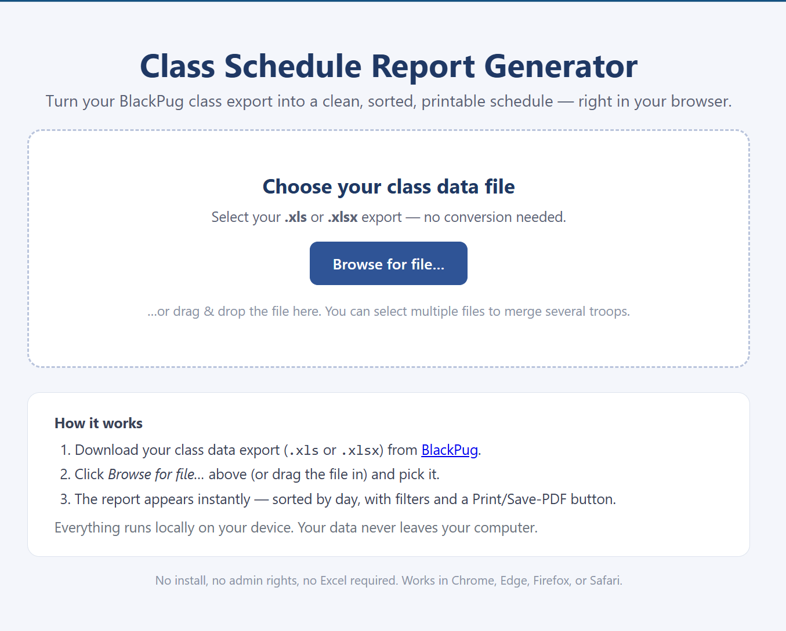
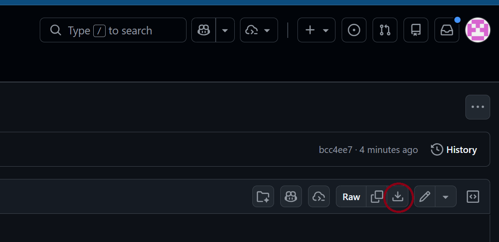
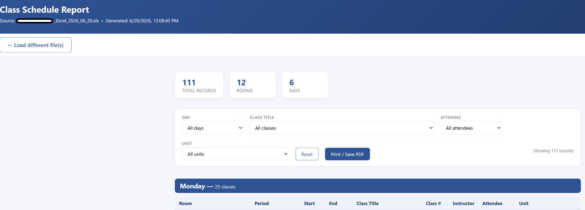

# Web App Guide — Class Schedule Report (No Install)

The easiest way to use the Class Schedule Report Generator. **No install, no admin rights, no Excel** — it runs entirely in your web browser, and your data never leaves your computer.

> Works in Chrome, Edge, Firefox, or Safari, on Windows, Mac, or Chromebook. Reads both **`.xls`** and **`.xlsx`** files directly — no conversion needed.

---

## What it looks like

When you open the tool, you'll see a simple landing page with a file picker:

---

## Step 1 — Download the web app

On this repo, open **`ClassScheduleReport.html`** and click the **Download raw file** button (the download icon, circled below). Save it anywhere — your Desktop or Downloads folder is fine.

> Tip: You can also use the green **Code → Download ZIP** button on the repo home page to grab everything at once.

---

## Step 2 — Get your data from BlackPug

Log in to **[BlackPug](https://scoutingevent.com/)** and download your class data export (`.xls` **or** `.xlsx`). No need to convert it — the tool reads both.

---

## Step 3 — Open the tool and choose your file

1. **Double‑click** the downloaded `ClassScheduleReport.html` to open it in your browser.
2. Click **"Browse for file…"** (or drag your spreadsheet onto the page).
3. Select your BlackPug export.

> To merge several troops into one report, select **multiple files** at once — then use the **Unit** filter to separate them.

---

## Step 4 — Use your report

The report appears instantly, sorted by day → start time → room → class title:

From here you can:

- **Filter** by **Day**, **Class Title**, **Attendee**, or **Unit** using the dropdowns.
- **Print / Save PDF** — click the button to print, with each **day on its own page** for clean handouts.
- **Load different file(s)** — click the button at the top to start over with a new export.

### What the tool fixes automatically

- **Spanning classes** — a course that runs across both the morning **and** afternoon sessions is automatically added to the afternoon and tagged **"added."**
- **Multi‑day courses** — a course that meets on more than one day (e.g., Lifesaving on Wednesday **and** Thursday) is listed on **each** day it meets.
- **Room dividers** — a bold line marks every change of room/area for easy scanning.

---

*Prefer the command line? See the [PowerShell Guide](POWERSHELL-GUIDE.md).*
